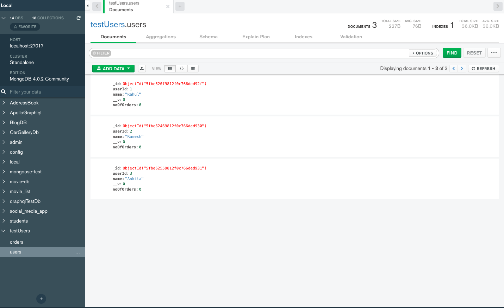

# Backend-Project

# Build status

# Screenshots
Before update api call Mongo Db collection

Respone of data

After Update MongoDb collection

Update API call response

# Tech/framework used

- Node
- MongoDB
- Mongoose ORM
- Express 
